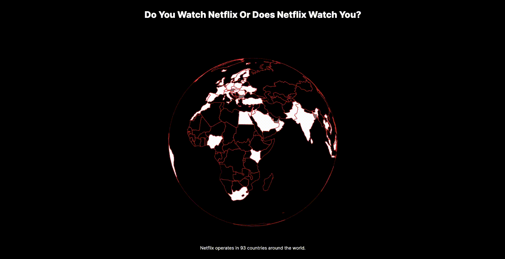

# Data Story: Do You Watch Netflix Or Does Netflix Watch You?

## *[Live Version of Data Story](https://shirley-liu32.github.io/cdv-student/projects/data_story/)*

Big data plays a huge role in today's digital age. Thus, I am exploring the extremely popular streaming service called Netflix and its influence around the world. They collect data on everything from every screenshot you take, every time you hit pause or play, your exact location. 

## Data Sources

Kaggle's dataset included Netflix TV show information such as genre, director, cast, maturity level, description, and more. The data from this csv was joined by the name of the TV shows that were listed in the top 10 global and country lists found on Netflix's website. 

*[Kaggle's Netflix Movies and TV Shows Data Set](https://www.kaggle.com/datasets/shivamb/netflix-shows)*

*[Netflix's Global Top 10 ](https://top10.netflix.com/)*

*[Netflix's Top 10 by Country ](https://top10.netflix.com/united-states)*

## The Process

Since my focus was on Netflix's influence around the world, I wanted to use the orthographic projection to visualize the data. The visualization displays all the countries that Netflix operates in. It definitely shows that Netflix is mostly focused in North and South America but it makes me wonder about the datapoints of people using VPNs to stream movies and TV shows. In addition to the globe, I also included information such as top genres and hours viewed for thee top 10 english shows and top 10 non-english shows globally.

One of the crucial compromises is not displaying the data about the top tv shows for each country on click. I would have also like to show the similarities between countries if they shared the same top TV shows. If I had more time, I would like to further the visualization of the orthographic projection to include more information on each country's top shows as well as the connections between the countries.
