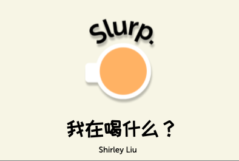
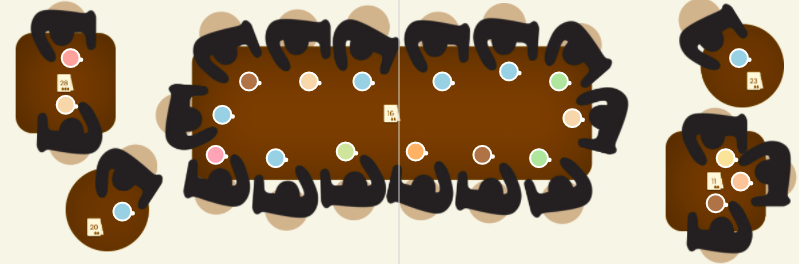
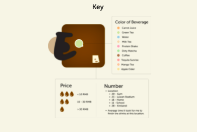
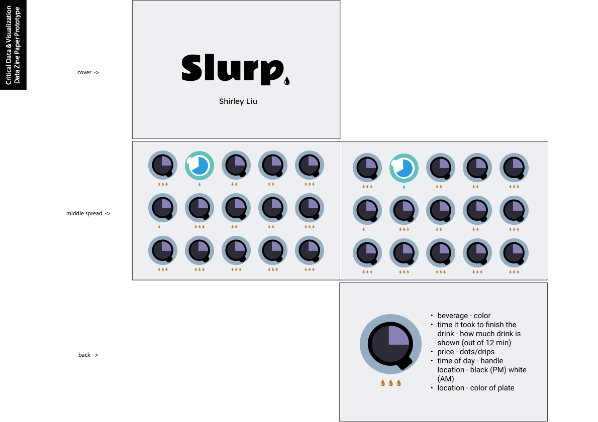

# Data Zine
## Slurp

I collected data about all the beverages I drank over the span of one week. I made sure to record how fast I finished the drinks as well as the time of day it was, the location, and price. As for the collection routine, I used google form to record every time I finished a drink. If I didn’t get a chance to record it directly in the form, I would write it in my notes.

In my paper prototype, my visualization consisted of rows of cups to show how fast I finished the drink as well as the price, and time of day with the handle location. After going over my idea and realizing it was kind of sterile and didn't represent liquid realistically, I decided to change to another format. In the new design, I wanted to create the top view of a cafe and display all the different drinks I had.

In the visualization, I found that the beverage I had the most was water which is slightly surprising to me as I often find myself drinking a lot of tea and coffee. However, it may just be that those are the beverages I remember the most as they are the ones that I spend the most money on. I was also abel to see that the beverages I finish the fastest are water and milk tea. Lastly, I spend more money on beverages if I go out to eat. However, this proves not to big of a problem as I mostly have my beverages at home.

As for the coding aspect of the project, I encountered issues with positioning of the different objects at first since they were not in rows and columns. I was able to place the cups onto the right tables but still had some trouble with implementing the rotation for the people and cups at the same time through the use of nested arrays. Thus, one of the biggest sacrifices I made was the exclusion of the time based on the handle position. To make any changes in the future, I would love to add the time aspect onto the handle and change the way I display information in order to highlight the cups instead of the people as they held no significance on the data. The number of people did highlight the locations that I drank the most beverages but perhaps excluding some of the people would have been better for the overall aesthetic and understanding of the information.

