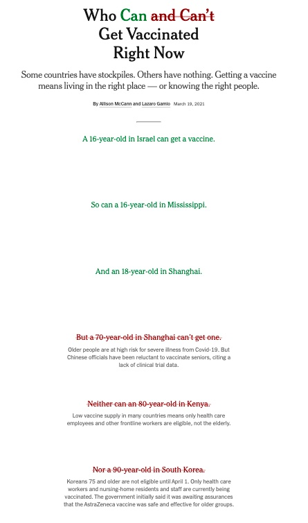

# Reading Response 2 (Data Feminism)
### *[On Rational, Scientific, Objective Viewpoints from Mythical, Imaginary, Impossible Standpoints](https://direct.mit.edu/books/book/4660/chapter/213287/On-Rational-Scientific-Objective-Viewpoints-from)* by Catherine D'Ignazio, Lauren F. Klein

### Data Visualization: *[Who Can and Can't Get Vaccinated Right Now](https://www.nytimes.com/interactive/2021/03/19/world/covid-vaccine-inequality.html)* by Allison McCann and Lazaro Gamio

I found this data visualization to be quite interesting to analyze as it is essentially made up of mostly words and a few maps. Published in March of 2021, the focus of this article is to inform people of how where you live and who you know affects your accessibility to getting the vaccine. We can see that a 16 year old in Israel and Missippi, and an 18 year old in Shanghai can get a vaccine. However, a 70 year old in Shanghai, a 80 year old in Kenya, and a 90 year old in South Korea cannot get a vaccine. Everyone that can get the vaccine is colored in green and those who can't are in red with a line running through. However, these colors may be hard to distinguish for people with red-green color blindness. This makes the visualization slightly less accessible to everybody so perhaps using a color gradient would be better. Besides the color aspect, this visualization aims to elevate emotions by highlighting the vaccine stockpile disparity that exists between high income and low income countries. 

McCann and Gamio do so by using very specific examples that may ignite anger or sadness in some, for example, finding out that a correctional officer in Tennessee can get a vaccine but a prisoner in Tennessee cannot. You can't get a vaccine if you live in Haiti, Papua New Ginea, or any of the 67 countries highlighted in the map. However, if you have connections such as being friends of the mayor of Manaus, Brazil or you're a lawmaker in Lebananon, a smoker in Illinois than you can get one. In every sentence, we can see how money and power determines if you can get vaccinated. This visualization is definitely not using the god trick to seem neutral while putting forth ideas through basic shapes and inclusion of sources. Instead, it highlights how people on the margin have limited access to vaccines as opposed to those with privilege,connections, and money. 
